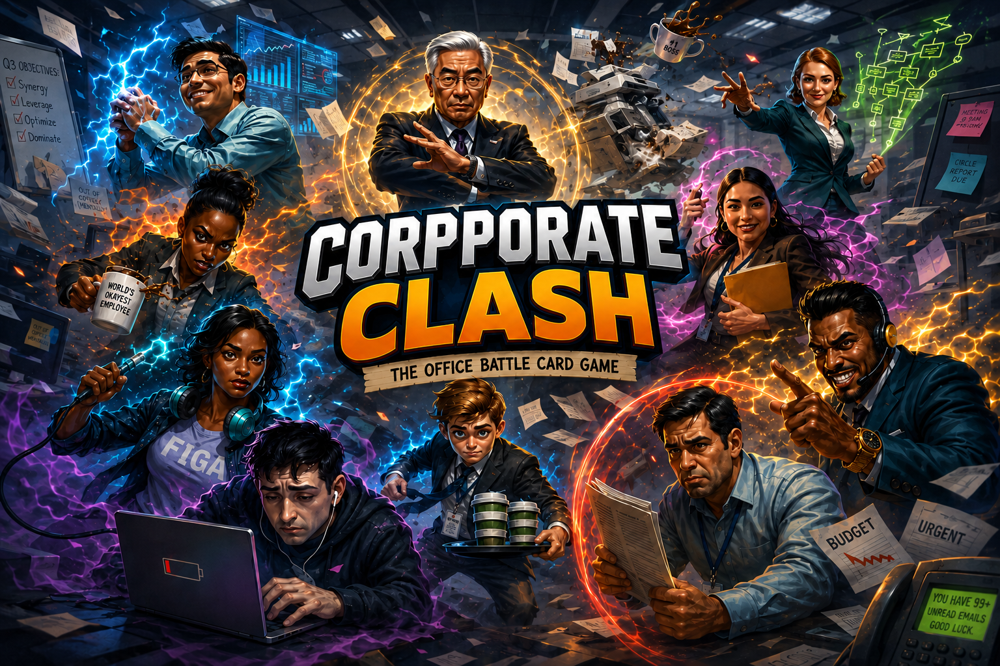

# Performance Review: The Office Battle Card Game

> *Finally, a game that captures the true violence of corporate America.*



## What Is This?

**Performance Review** is a browser-based trading card game where stereotypical office employees battle each other in Pokémon-style turn-based combat. Play cards like *The Intern*, *The Sales Bro*, and *The CEO* — each with unique abilities ripped straight from the horrors of open-plan offices.

It's the game nobody at your company asked for, built during time that could've been spent on actual deliverables.

## How To Play

1. **Build a deck** of 20 office employees (or let fate decide with Quick Battle)
2. **Play cards** from your hand by spending Energy (refills each turn, like your coffee)
3. **Attack** the opponent's active card — damage = your Influence minus their Tenure (just like real life)
4. **Use abilities** — put enemies in mandatory meetings, spread office gossip, or have the IT Guy reboot everything
5. **Win** by KO'ing all opponent cards, or taking down their CEO for an instant victory

### Department Matchups

It's rock-paper-scissors, but with more passive aggression:

```
Sales > People-Ops > Engineering > Finance > Creative > Operations > Sales
Caffeine is neutral (it doesn't pick sides, it just vibrates)
```

Super effective = 1.5x damage. Not very effective = 0.75x. Same department = "we should really be collaborating on this" (1.0x).

## The Roster (v1)

| Card | Rarity | Dept | Signature Move |
|------|--------|------|----------------|
| The Intern | Intern | Caffeine | *It's My First Day* — can't be targeted on entry. Classic. |
| The Bootlicker | Associate | People-Ops | *Yes, Absolutely!* — gets stronger with more allies. Shocking. |
| The Quiet Quitter | Associate | Operations | *Acting Your Wage* — costs 0, does 50% damage, takes 50% damage. Minimum viable effort. |
| The Office Gossip | Associate | People-Ops | *Rumor Mill* — debuffs enemy Influence. Words hurt. |
| The Middle Manager | Senior | Operations | *Delegate* — attacks using someone else's stats. Peak management. |
| The IT Guy | Senior | Engineering | *Turn It Off and On Again* — clears all status effects. Have you tried it? |
| The Sales Bro | Senior | Sales | *Closing the Deal* — double damage to enemies stuck in meetings. |
| The HR Rep | Director | People-Ops | *Let's Sync* — traps an enemy in a meeting for 2 turns. Devastating. |
| The Consultant | Director | Finance | *Billable Hours* — gains 2 extra energy next turn. Expensive but worth it (allegedly). |
| The Office Mom | Director | People-Ops | *Banana Bread* — heals all allies for 10 each turn. The real MVP. |
| The Visionary Founder | VP | Creative | *Disrupt* — shuffles opponent's bench back into their deck. Move fast, break things. |
| The CFO | VP | Finance | *Budget Cuts* — permanently reduces opponent's max energy. Ruthless. |
| The CEO | C-Suite | Operations | *All-Hands* — buffs everyone +10 Influence. But if KO'd, you instantly lose. High risk, high reward, just like that pivot to AI. |
| The Burnout | Associate | Caffeine | *Caffeine Crash* — hits hard turn 1, loses 10 Influence every turn after. We've all been there. |
| The Overachiever | Senior | Engineering | *Crunch Time* — attacks twice but takes 15 self-damage. Sleep is for people without OKRs. |

## Tech Stack

- **Vanilla TypeScript + Vite** — no React, no framework, no sprint planning meetings about which framework to use
- **HTML/CSS DOM rendering** — cards are `<div>`s, not canvas sprites, because we believe in accessibility (and also it was faster to build)
- **Zustand-style vanilla store** — a single `store.ts` with a subscribe pattern. 49 lines. Take that, Redux.
- **No backend** — everything runs client-side. Your deck saves to `localStorage` like nature intended.
- **~2,000 lines of TypeScript** — the entire codebase is readable in one sitting, which is more than can be said for your company's onboarding docs

## Running Locally

```bash
git clone https://github.com/corycowgill/synergyGame.git
cd synergyGame
npm install
npm run dev
```

Then open `http://localhost:5173` and prepare for corporate warfare.

## Project Structure

```
src/
├── data/
│   ├── cards.ts          # All 15 card definitions
│   ├── abilities.ts      # 16 ability implementations
│   ├── types.ts          # TypeScript interfaces
│   └── tutorialSteps.ts  # Guided tutorial script
├── engine/
│   ├── battle.ts         # Turn loop & player actions
│   ├── combat.ts         # Damage calc & KO resolution
│   ├── ai.ts             # "AI" (a priority checklist wearing a trenchcoat)
│   ├── deck.ts           # Shuffle, draw, instance creation
│   ├── matchups.ts       # Department type chart
│   └── tutorial.ts       # Tutorial state machine
├── ui/
│   ├── battleScene.ts    # Full battle UI with animations
│   ├── cardComponent.ts  # Reusable card renderer
│   ├── deckBuilder.ts    # Deck construction screen
│   ├── handUI.ts         # Player hand display
│   ├── hud.ts            # Energy/deck/hand counters
│   ├── mainMenu.ts       # Title screen
│   └── tutorialOverlay.ts # Tutorial spotlight system
├── styles/
│   ├── main.css          # Global styles & CSS variables
│   ├── cards.css         # Card component styles
│   └── battle.css        # Battle, menu, tutorial, mobile CSS
├── main.ts               # Entry point & screen router
└── store.ts              # Global state (49 lines of zen)
```

## Features

- **15 unique cards** with hand-crafted art and thematic abilities
- **Department matchup system** — 7 types with a circular advantage chain
- **AI opponent** — plays cards, uses abilities, swaps when low HP. Not unbeatable, but will make you think twice before playing The Intern on turn 6.
- **Deck builder** — pick 20 cards, max 3 copies each, max 1 C-Suite
- **Tutorial mode** — step-by-step guided match with spotlight overlays
- **Animations** — attack lunges, hit flashes, floating damage numbers, KO fades
- **Mobile responsive** — playable on iPhone. Yes, you can play this in a real meeting.
- **Save/load** — deck persists in localStorage across sessions

## How It Was Built

This entire game was built in a single session by a human with a vision and an AI that types fast. The human provided the game design, card art, and creative direction. The AI provided the TypeScript, the CSS, and an unreasonable number of semicolons.

No Jira tickets were created. No standups were held. No one asked "can we circle back on this?" It was beautiful.

## Known Issues

- The AI doesn't bluff. It plays its best card immediately, like a Sales Bro at happy hour.
- The Quiet Quitter is arguably the best card in the game despite having 5 Influence. This is realistic.
- There is no sound yet. The hooks are there, waiting for someone to record a Slack notification ping and a printer jam noise.
- The HR Complaints alt-win condition is scaffolded but not implemented. Just like your company's DEI initiative.

## License

MIT — do whatever you want with it. Put it on your resume. We won't tell.

---

*Built with TypeScript, Vite, and an mass amount of caffeine (the real-life department, not the in-game one).*
